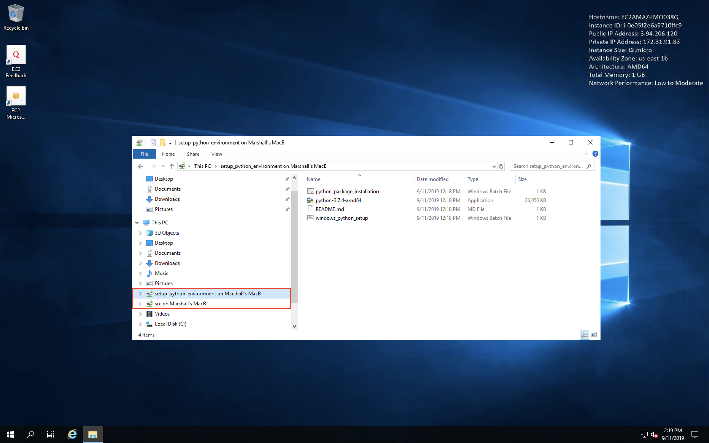
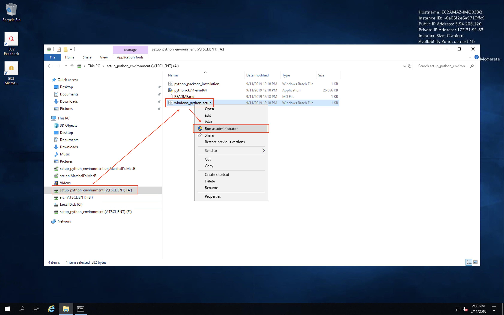
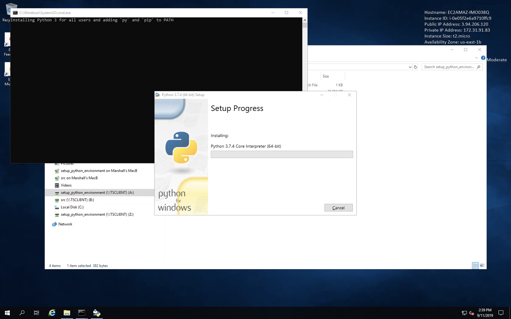
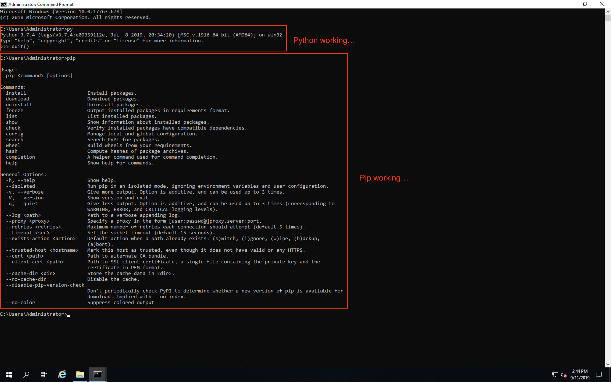
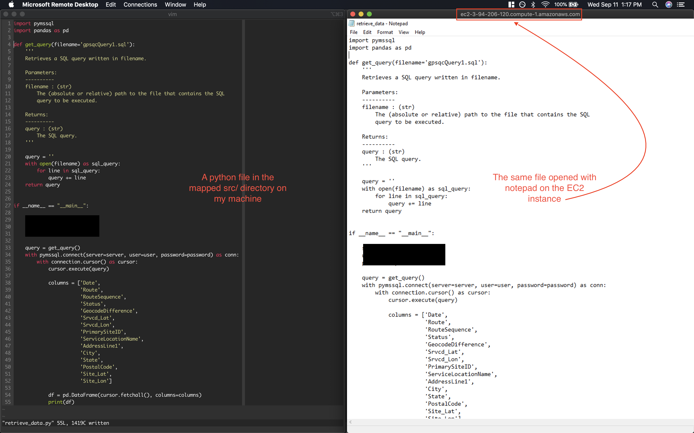
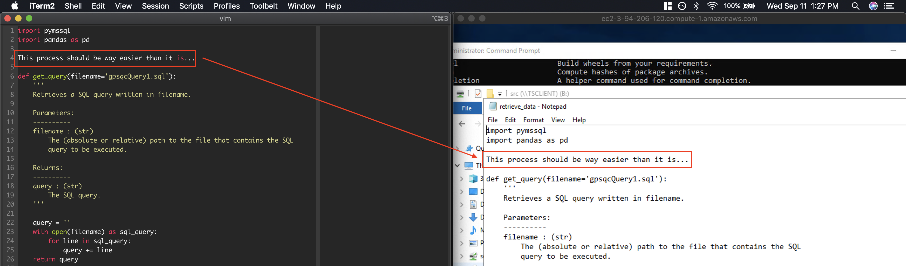

# Overview

As of the time of the writing, connecting to an AWS EC2 instance running the
Windows OS can only be scripted up to a point, unlike Linux instances. The files
in this directory are designed to create a Windows instance and get Python
installed, as well as link a directory from your (the user's) physical machine
to the EC2 instance for development purposes.

### Requirements

* `awscli` - Can be installed using `pip install awscli`.
	* Once this has been installed, run `aws configure` from the command line.
	This will setup the ~/.aws/ directory with two files, ~/.aws/config and
	~/.aws/credentials. You will need your Access Key ID and Secret Access Key
	in order to complete this process - see [Configuring the AWS CLI](https://docs.aws.amazon.com/cli/latest/userguide/cli-chap-configure.html#cli-quick-configuration) for information regarding
	these two.

* key_pairs directory
	* After `aws configure` has been run, create a directory named key_pairs in
	the ~/.aws/ directory (`mkdir ~/.aws/key_pairs/`). Once you have [created a
	key pair](https://docs.aws.amazon.com/AWSEC2/latest/UserGuide/ec2-key-pairs.html#having-ec2-create-your-key-pair), download it and put it in this newly created directory.

* Microsoft Remote Desktop
	* Has been tested with Version 10.3.2

### Setup

1. Run `launch_windows_instance.sh` (`bash launch_windows_instance.sh`). Follow
the instructions that are printed to stdout.

2. Open Microsoft Remote Desktop, click 'Add Desktop' (or click the '+'
dropdown menu in the upper left of the application and then click 'Desktop').

3. Copy the Public DNS in the dialogue box on AWS and paste it into 'PC Name'
in Microsoft Remote Desktop. Click 'Add User Account...' in the 'User account'
drop down menu, and copy/paste the User name and decrypted password into the 
appropriate fields.

4. **Before you click 'Add'**, click the 'Folders' tab in the 'Add a Desktop'
dialogue box. Select 'Redirect folders', then click the '+' in the bottom left
of the dialogue box. Add the setup_python_environment/ directory, in addition to
the directory that contains the code you will be developing (you will have to 
add these separately).

5. Click 'Add' to add the remote connection.

6. Double-click or hit 'return' on your keyboard to connect to the instance.
Select continue when prompted.

7. Once you are 'in' the Windows instance, open File Explorer and click 'This PC'
to show all the directories available. In addition to the traditional Downloads,
Desktop, etc., you should see the two directories you selected in step 4 (see
image below, in the red highlight box)

You would think that you're good to go and you could access these from Command
prompt/Windows Powershell right? Wrong! Why, you ask? Windows, that's why.

8. Right-click/two-finger click 'Network' and select 'Map network drive...'

9. Choose whatever letter you want for 'Drive' and use `\\tsclient\setup_python_environment\`
for the setup_python_environment/ directory. Repeat this process for the other directory
from step 4, choosing a different drive and using the directory name as the
subdirectory name (i.e. if the name of the directory is src/, use `\\tsclient\src\`).

10. Click the newly mapped drive in the 'This PC' drop down, right-click/two-finger
click the `windows_python_setup.bat` batch file, and select 'Run as administrator'.

11. The Python installer will pop up, showing the installation progress:

12. Once this is complete, follow the commands that will be printed to stdout
in the Command Prompt that opened when you ran the batch file. Doing so should
open up the Python interpreter when `py` is run at the command line (regardless
of the directory you are in) and the pip help page when `pip` is run at the
command line (regardless of which directory you are in).

13. Now you are setup to develop on your machine and run your code on the EC2 instance.
Any changes you make to file within a mapped drive will show up in the file
on the Windows instance once the file is saved on your machine and reopened on
the EC2 instance.

Example: **BEFORE**

Example: **AFTER**

